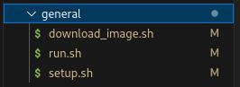
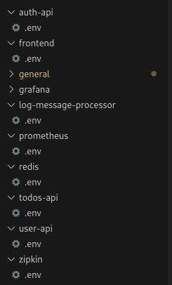
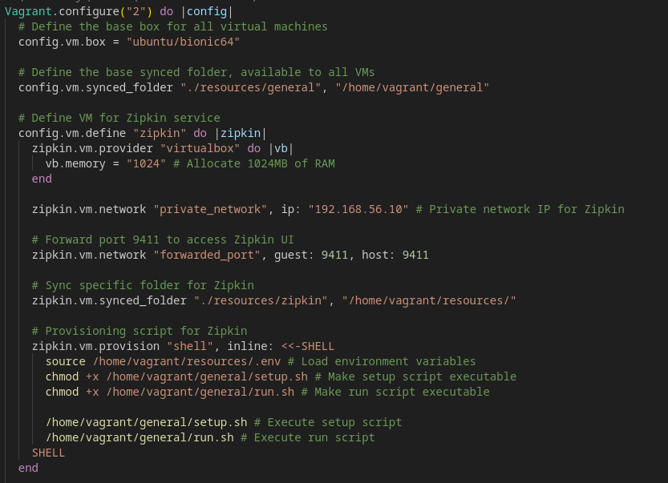
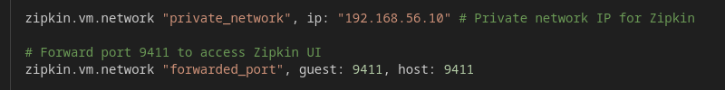
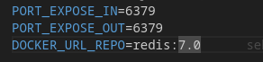
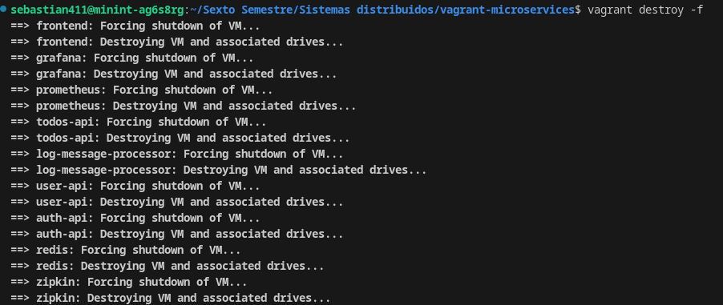
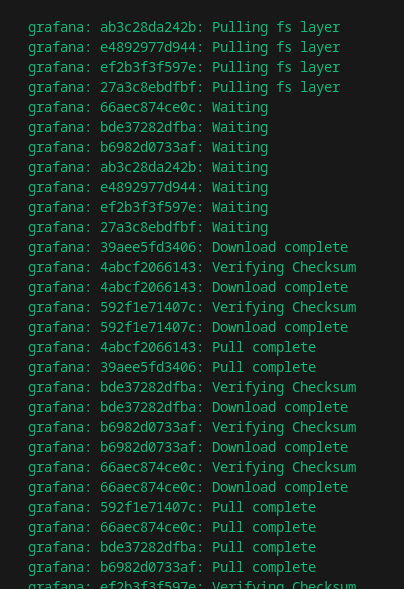
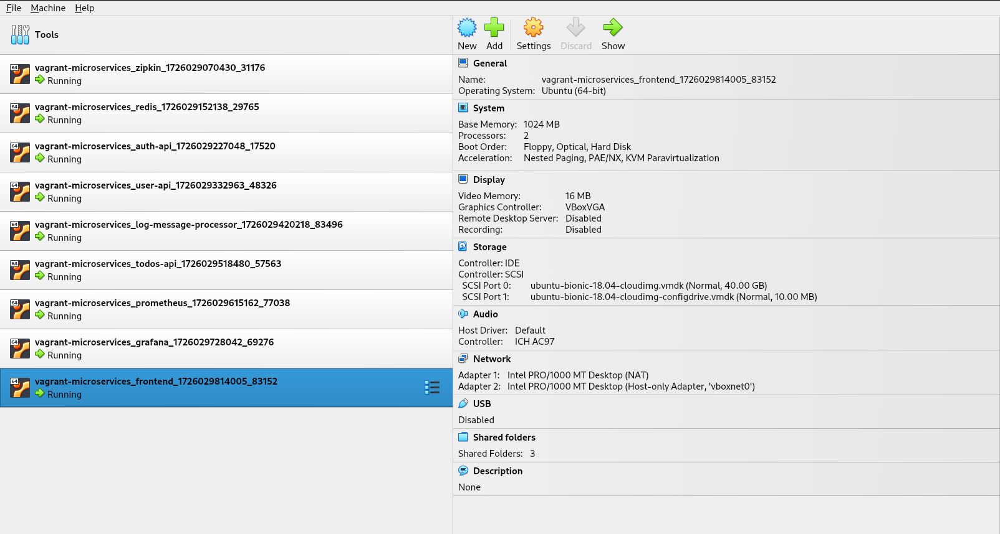

### 📝 Informe de Taller: Despliegue de Microservicios con Vagrant y Docker 🚀

---

## 🎯 **Objetivo**

El propósito de este taller fue configurar y desplegar una serie de microservicios utilizando Vagrant y Docker. Cada microservicio se ejecuta en su propia máquina virtual (VM), con una red privada establecida para facilitar la comunicación entre ellos. La estrategia incluyó la creación de scripts automatizados para simplificar y agilizar el proceso.

---

## 🛠️ **Requerimientos del Sistema**

Para desplegar y gestionar los microservicios en el entorno descrito, se necesitan los siguientes componentes:

### **1. Vagrant 🧳**

- **Descripción:** Herramienta para la construcción y gestión de entornos de desarrollo virtualizados.
- **Requisito:** Debe estar instalado en el sistema. Usa una versión compatible con el `Vagrantfile`.
- **Instalación:** [Descargar Vagrant](https://www.vagrantup.com/downloads).

### **2. VirtualBox 🖥️**

- **Descripción:** Herramienta de virtualización para ejecutar múltiples sistemas operativos en una sola máquina física.
- **Requisito:** Debe estar instalado en el sistema. Asegúrate de que la versión sea compatible con la versión de Vagrant.
- **Instalación:** [Descargar VirtualBox](https://www.virtualbox.org/wiki/Downloads).

---

### **Ejecución del Despliegue 🚀**

Una vez instalados Vagrant y VirtualBox, ejecuta el siguiente comando para iniciar el despliegue:

```bash
vagrant up
```

- **Descripción:** Inicia y configura las máquinas virtuales definidas en el `Vagrantfile`, descargando las boxes necesarias y ejecutando los scripts de provisión.
- **Nota:** Ejecuta el comando en el directorio raíz con el `Vagrantfile`.

---

## 📁 **Estructura del Repositorio y Comportamiento de Cada Ruta**

A continuación, se detalla el comportamiento de cada ruta en el repositorio y la función de los archivos y directorios en el contexto del despliegue de microservicios.

### **`resources/`**: Directorio raíz que contiene todos los recursos necesarios para los microservicios y scripts de configuración.

- **`auth-api/`**: Recursos específicos para el servicio de autenticación, incluyendo el archivo `.env` para la configuración del servicio.
- **`frontend/`**: Recursos del frontend, con archivo `.env` para la configuración de la interfaz de usuario.
- **`general/`**: Scripts genéricos utilizados por todos los servicios:
  - **`download_image.sh`**: Descarga imágenes Docker y ejecuta contenedores.
  - **`run.sh`**: Maneja la ejecución de servicios y configuración de puertos.
  - **`setup.sh`**: Configura el entorno y verifica la existencia del archivo `.env`.
- **`grafana/`**: Recursos para Grafana, incluyendo el archivo `.env` para la visualización de datos.
- **`log-message-processor/`**: Recursos para el procesador de mensajes de log.
- **`prometheus/`**: Recursos para Prometheus, con archivo `.env` para el monitoreo y alerta.
- **`redis/`**: Recursos para Redis, incluyendo el archivo `.env` para almacenamiento en memoria.
- **`todos-api/`**: Recursos para el servicio de gestión de tareas, con archivo `.env`.
- **`user-api/`**: Recursos para el servicio de gestión de usuarios, con archivo `.env`.
- **`zipkin/`**: Recursos para Zipkin, incluyendo el archivo `.env` para el rastreo de solicitudes.
- **`Vagrantfile`**: Archivo de configuración principal que define las máquinas virtuales, configuraciones, sincronización de carpetas y provisión de scripts.

---

## 🔧 **Estrategia y Procedimiento**

### 1. **Diseño de la Solución**

Tres scripts clave fueron implementados para la automatización:

- **`setup.sh`**: Configura la máquina virtual y el entorno necesario.
- **`run.sh`**: Carga las variables de entorno y ejecuta los servicios.
- **`download_image.sh`**: Descarga la imagen Docker requerida y levanta el contenedor correspondiente.



### 2. **Variables de Entorno Dinámicas**

Cada microservicio tiene su propio archivo `.env`, que contiene configuraciones específicas como:

- Nombre de la imagen Docker.
- Puertos de escucha y exposición.
- Cantidad de réplicas.

Esto permite una gestión flexible y personalizada sin duplicar configuraciones.



---

## ⚙️ **Despliegue en Vagrant**

### 1. **Configuración del `Vagrantfile`**

El `Vagrantfile` define múltiples VMs, cada una con su propia configuración de red y carpetas sincronizadas. Cada VM se configura y despliega usando los scripts Bash genéricos.



### 2. **Red Privada para Comunicación**

Las VMs se comunican a través de una red privada, asignando IPs internas para cada servicio y evitando la exposición de puertos al exterior.

- **IP privada de Redis:** 192.168.56.11
- **IP privada de Zipkin:** 192.168.56.10
- **IP privada de Prometheus:** 192.168.56.17



---

## 🚧 **Problemas Encontrados y Soluciones**

### 1. **Redis no Captaba Eventos Adecuadamente**

- **Problema:** Redis no capturaba eventos correctamente.
- **Solución:** Ajuste en la carga de servicios y configuración de IPs para mejorar la captura de eventos.



### 2. **Persistencia de Datos en las Máquinas Virtuales**

- **Problema:** Las máquinas virtuales retenían datos de despliegues anteriores.
- **Solución:** Implementación de procesos de limpieza automatizados para evitar problemas en futuros despliegues.



---

## 📊 **Monitoreo e Integración con Zipkin**

Se integró Zipkin para rastrear y visualizar las peticiones entre microservicios, asegurando una correcta trazabilidad.

---

## 📦 **Despliegue con Docker**

El despliegue de microservicios con Docker fue efectivo, aunque la descarga y ejecución de imágenes puede ser lenta. Docker demostró ser eficiente para la gestión y ejecución de servicios.



---

## ✅ **Conclusión**

El taller logró con éxito el despliegue y configuración de microservicios utilizando Vagrant y Docker. Los desafíos iniciales, como la persistencia de datos y problemas de conexión con Redis, fueron abordados con soluciones efectivas. La automatización con scripts y el uso de variables de entorno dinámicas contribuyeron a un proceso de despliegue más fluido y eficiente.

